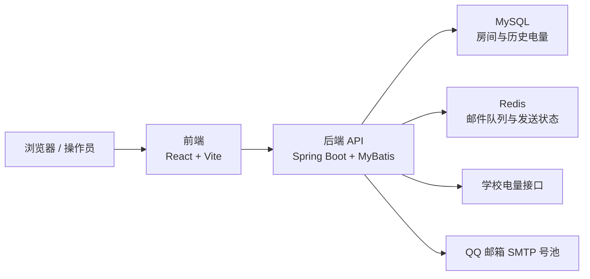
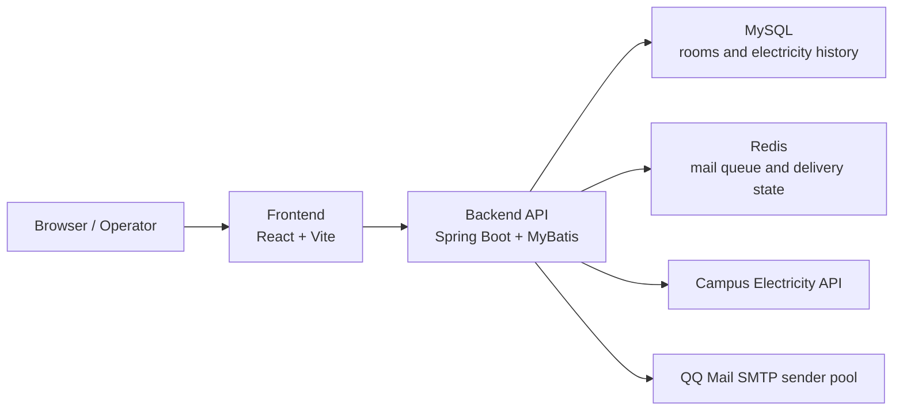

# PowerGuard

<div align="center">

<h1>PowerGuard</h1>

<p>
  <strong>Full-stack dormitory electricity monitoring, alerting, and scheduled query platform.</strong>
</p>

<p>
  
  
  
  
  
  
</p>

<p>
  
  
  
  
</p>

<p>
  <a href="#简体中文">简体中文</a> |
  <a href="#english">English</a>
</p>

</div>

---

## 简体中文

### 项目简介

PowerGuard 是一个面向宿舍场景的电量监控与预警平台，核心目标是把“查询电量”“识别风险”“推送告警”“展示趋势”串成一条完整闭环。

它包含两个主要部分：

- `frontend/`：用于展示房间状态、趋势图、统一查询倒计时、房间管理面板
- `backend/`：负责轮询外部电量接口、持久化数据、执行预警规则、发送邮件

### 亮点特性

- 每 30 分钟统一查询所有启用房间电量
- 支持手动刷新，但不会打乱统一轮询节奏
- 房间状态按优先级排序展示：
  - `告警`
  - `阈值附近`
  - `正常`
- 支持低电量预警邮件、静默期延迟补发、22:00 每日汇总
- 房间创建时自动读取首次数值作为初始容量
- 房间删除时同步删除房间本体和全部历史耗电记录
- 新建和修改房间都保证唯一性
- 前端支持移动端浏览，新增房间弹窗可滚动

### 系统架构



### 状态模型

| 状态 | 条件 | 优先级 |
| --- | --- | --- |
| `ALERT` | `remain <= threshold` | 最高 |
| `WARNING` | `threshold < remain <= threshold + 10` | 中 |
| `NORMAL` | `remain > threshold + 10` | 最低 |

### 定时任务节奏

| 时间 | 动作 |
| --- | --- |
| 每小时 `00 / 30` 分 | 统一查询全部房间电量 |
| `07:00` | 处理静默期延迟告警 |
| `22:00` | 发送每日汇总邮件 |
| `00:00` | 清理发件账号日计数 |

### 仓库结构

```text
Project
├─ frontend
│  ├─ src
│  ├─ package.json
│  └─ README.md
├─ backend
│  ├─ src/main/java/com/scorpio/powerguard
│  ├─ src/main/resources
│  ├─ pom.xml
│  └─ README.md
└─ README.md
```

### 技术栈

#### 前端

- React 18
- TypeScript
- Vite 5
- Tailwind CSS
- Recharts
- Lucide React

#### 后端

- Spring Boot 3.3.5
- Java 17
- MyBatis
- MySQL
- Redis
- JavaMailSender
- Hutool

### 快速启动

#### 1. 启动后端

环境要求：

- JDK 17
- MySQL
- Redis

初始化数据库：

- `backend/src/main/resources/sql/schema.sql`
- `backend/src/main/resources/sql/seed_email_sender_pool.sql`

运行：

```bash
cd backend
mvn spring-boot:run
```

默认端口：

```text
8080
```

#### 2. 启动前端

```bash
cd frontend
npm install
npm run dev
```

默认开发端口：

```text
5173
```

### 生产构建

#### 后端打包

```bash
cd backend
mvn clean package -DskipTests
```

产物：

```text
target/power-guard-backend-1.0.0.jar
```

#### 前端打包

```bash
cd frontend
npm install
npm run build
```

产物：

```text
dist/
```

### API 概览

| 方法 | 路径 | 说明 |
| --- | --- | --- |
| `POST` | `/api/rooms` | 新建房间 |
| `PUT` | `/api/rooms/{id}` | 修改房间 |
| `DELETE` | `/api/rooms/{id}` | 删除房间及全部历史数据 |
| `POST` | `/api/rooms/refresh` | 手动刷新全部房间 |
| `GET` | `/api/rooms/status` | 获取房间状态列表 |
| `GET` | `/api/rooms/{id}/trend?days=7` | 获取房间趋势数据 |

### 适合展示的点

如果你要把这个项目放到 GitHub 仓库首页展示，最值得强调的是：

1. 这不是纯 CRUD，而是一套完整的监控闭环
2. 有真实的定时轮询、告警策略、静默期和队列邮件投递
3. 前后端分层清楚，业务规则集中在后端，展示体验集中在前端
4. 既有实时状态，也有历史趋势和调度节奏展示

---

## English

### Overview

PowerGuard is a dormitory electricity monitoring and alerting platform designed around one complete workflow:

query electricity, detect risk, persist snapshots, trigger alerts, and present everything clearly in a dashboard.

The repository contains two major parts:

- `frontend/`: dashboard UI, room management, trend visualization, and global scheduled-query countdown
- `backend/`: external API polling, persistence, alert rules, scheduling, and email delivery

### Key Features

- Unified electricity fetch for all active rooms every 30 minutes
- Manual refresh without resetting the scheduled polling cadence
- Room ordering by urgency:
  - `ALERT`
  - `WARNING`
  - `NORMAL`
- Low-balance alerts, quiet-hour deferred alerts, and `22:00` daily summaries
- Initial capacity automatically derived from the first successful remain query
- Room deletion removes both the room and all historical electricity records
- Room uniqueness is enforced on both create and update
- Mobile-friendly frontend, including a scrollable create-room modal

### Architecture



### Status Model

| Status | Condition | Priority |
| --- | --- | --- |
| `ALERT` | `remain <= threshold` | Highest |
| `WARNING` | `threshold < remain <= threshold + 10` | Medium |
| `NORMAL` | `remain > threshold + 10` | Lowest |

### Scheduler Cadence

| Time | Action |
| --- | --- |
| Every hour at `00 / 30` | unified electricity fetch |
| `07:00` | deferred quiet-hour alert processing |
| `22:00` | daily summary email |
| `00:00` | sender daily counter cleanup |

### Repository Layout

```text
Project
├─ frontend
│  ├─ src
│  ├─ package.json
│  └─ README.md
├─ backend
│  ├─ src/main/java/com/scorpio/powerguard
│  ├─ src/main/resources
│  ├─ pom.xml
│  └─ README.md
└─ README.md
```

### Tech Stack

#### Frontend

- React 18
- TypeScript
- Vite 5
- Tailwind CSS
- Recharts
- Lucide React

#### Backend

- Spring Boot 3.3.5
- Java 17
- MyBatis
- MySQL
- Redis
- JavaMailSender
- Hutool

### Quick Start

#### 1. Start backend

Requirements:

- JDK 17
- MySQL
- Redis

Initialize the database with:

- `backend/src/main/resources/sql/schema.sql`
- `backend/src/main/resources/sql/seed_email_sender_pool.sql`

Run:

```bash
cd backend
mvn spring-boot:run
```

Default port:

```text
8080
```

#### 2. Start frontend

```bash
cd frontend
npm install
npm run dev
```

Default dev port:

```text
5173
```

### Production Build

#### Backend package

```bash
cd backend
mvn clean package -DskipTests
```

Artifact:

```text
target/power-guard-backend-1.0.0.jar
```

#### Frontend package

```bash
cd frontend
npm install
npm run build
```

Artifact:

```text
dist/
```

### API Surface

| Method | Endpoint | Description |
| --- | --- | --- |
| `POST` | `/api/rooms` | create a room |
| `PUT` | `/api/rooms/{id}` | update a room |
| `DELETE` | `/api/rooms/{id}` | delete room and all history |
| `POST` | `/api/rooms/refresh` | manually refresh all active rooms |
| `GET` | `/api/rooms/status` | get room status list |
| `GET` | `/api/rooms/{id}/trend?days=7` | get room trend data |

### Why This Repository Presents Well

If you want this project to look strong on GitHub, the best showcase points are:

1. It is a real monitoring workflow rather than a simple CRUD demo
2. It includes scheduling, alert rules, deferred delivery, and queue-based email handling
3. The frontend and backend have clear ownership boundaries
4. It combines real-time state, historical trends, and operational cadence in one system

---

## Module Docs

- Frontend details: [frontend/README.md](./frontend/README.md)
- Backend details: [backend/README.md](./backend/README.md)

---

## License

This repository currently does not declare an open-source license.

